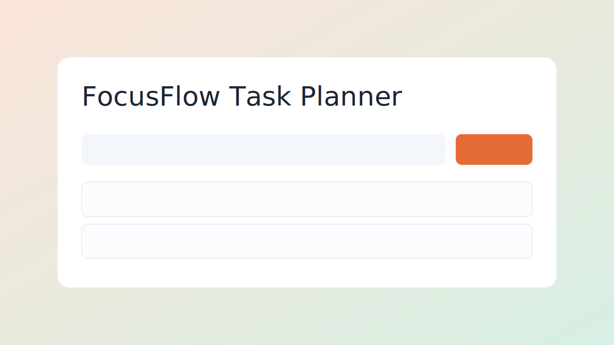
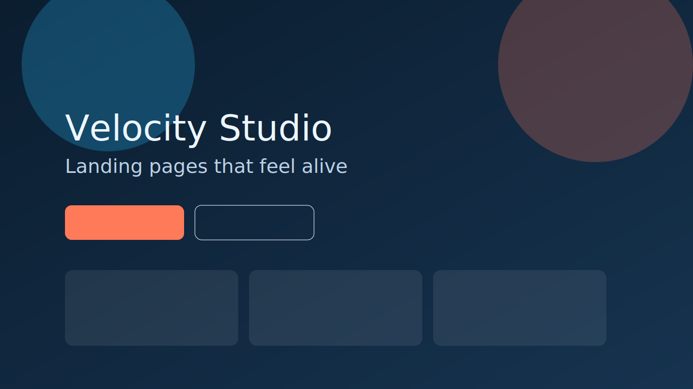
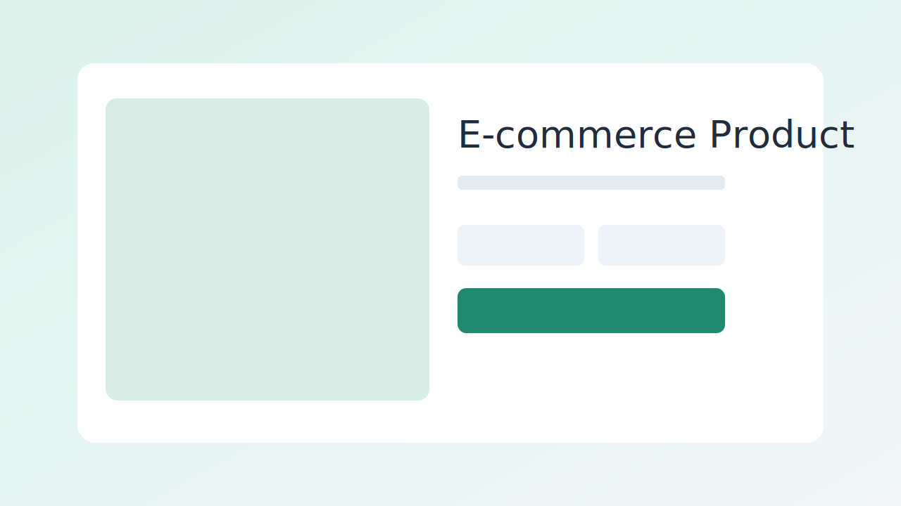
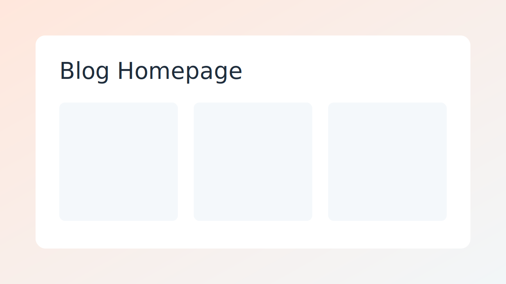
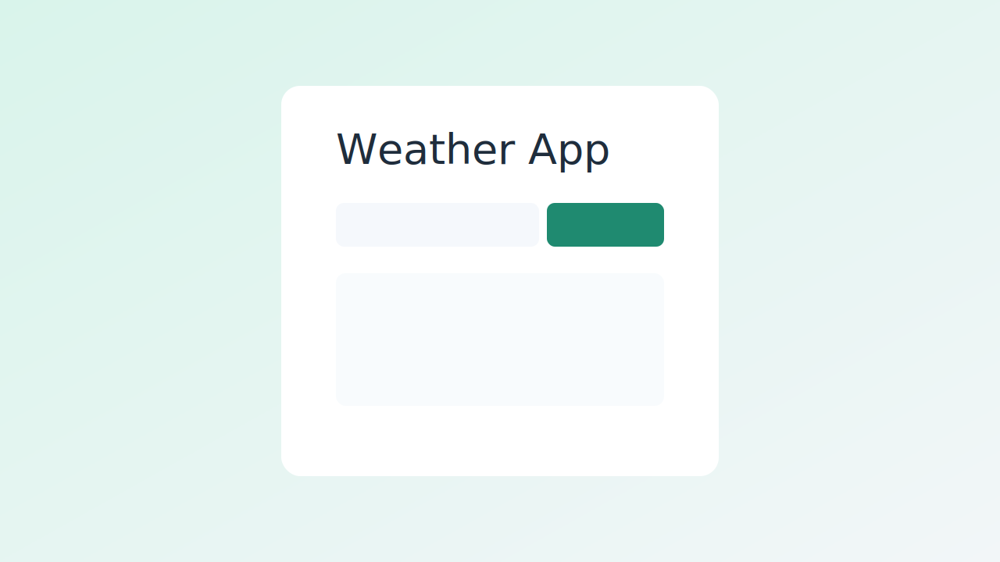
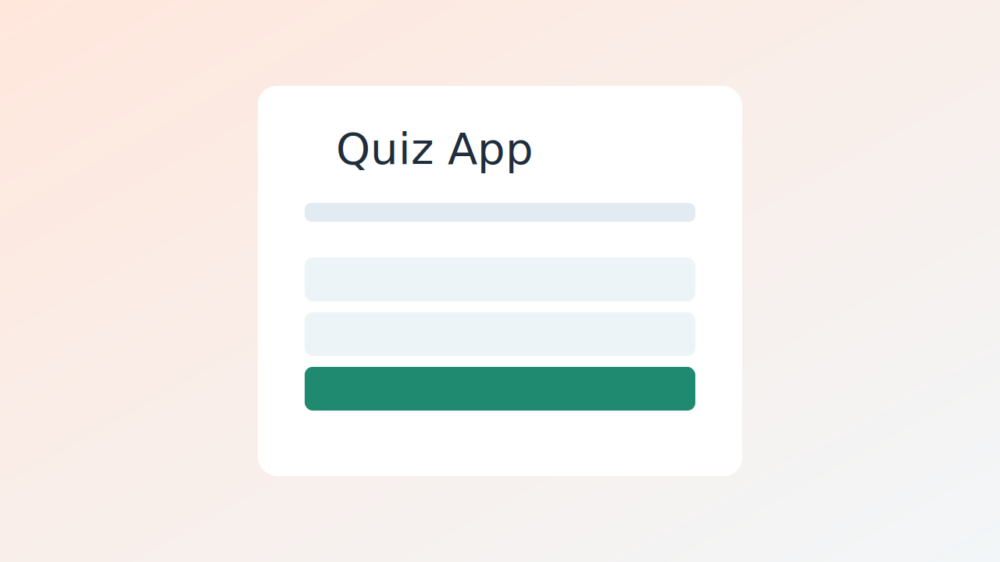

# web_dev-projects

Frontend mini-project collection by **hashbuilder60-netizen**.

## Live Site
- [GitHub Pages](https://hashbuilder60-netizen.github.io/web_dev-projects/)

## Projects
### 1) FocusFlow Task Planner
Path: `focusflow-task-planner/`

### 2) Landing Page Starter
Path: `landing-page-starter/`

### 3) Portfolio Website
Path: `portfolio-website/`

### 4) E-commerce Product Page
Path: `ecommerce-product-page/`

### 5) Blog Homepage
Path: `blog-homepage/`

### 6) Weather App
Path: `weather-app/`

### 7) Quiz App
Path: `quiz-app/`

## License
MIT - see `LICENSE`.